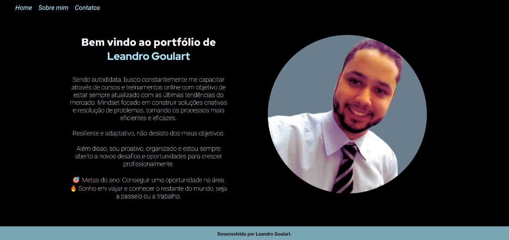

# Página de Apresentação Pessoal - Portifólio
Este projeto consiste em uma página de apresentação pessoal responsiva com descrição de currículo HTML. Ele foi desenvolvido para fornecer uma visão geral das habilidades e experiências de um indivíduo de forma acessível e atraente.

Você pode acessá-lo por aqui : [Portifólio](https://leandrogoulart.github.io/Portfolio/)

## Funcionalidades Principais
Responsividade: A página é projetada para se adaptar a diferentes tamanhos de tela, garantindo uma experiência de usuário consistente em dispositivos móveis, tablets e desktops.

## Currículo Interativo: 
Apresenta informações relevantes sobre o indivíduo, como histórico educacional, experiência profissional, habilidades, projetos e outras realizações.

# Como Utilizar
Faça o Download ou Clone do repositório.
Abra o arquivo index.html em seu navegador da web para visualizar a página.
Navegue pelas diferentes seções para explorar o currículo e outras informações pessoais.   

Para personalizar o conteúdo, edite o arquivo HTML conforme necessário, adicionando ou removendo seções de acordo com suas preferências.

# Tecnologias Utilizadas
'''HTML5'''
CSS3 (para estilos e layout responsivo)
# Autor
Este projeto foi desenvolvido por __Leandro Goulart__. Para mais informações ou contato, visite [Minha página no Linkedin](https://www.linkedin.com/in/leandrovgoulart/).